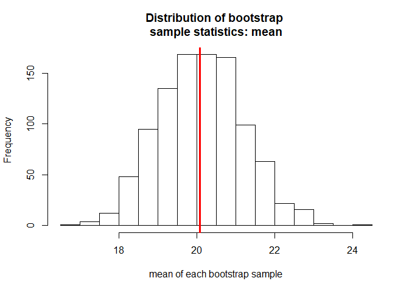

# bootEd

The package bootEd was created to facilitate the teaching of bootstrap intervals in introductory statistics classrooms. It it written with easy-to-read syntax, communicative output, and vectorized coding in order to ensure that students can get started with the package easily. The percentile, basic, and student-ized bootstrap intervals as outlined by Davison, A., & Hinkley, D. (1997) are implemented.

The package bootEd was written in such a way that it would communicate with the students and
prompt them to actively apply these methods while taking the time to consider if assumptions are
met and deciding on the next best course of action. We also wanted to ensure that students could
get working quickly without having to specify or use other functions. We believe that bootEd has
pedagogical benefits because of its user-friendliness, efficiency, easy-to-read syntax, and more. That
being said, we note that bootEd was written for introductory statistics courses, therefore, for more
complex bootstrapping processes, boot would be the superior option. In the next sections we make
some comparisons between packages that are devoted entirely to bootstrapping so that teachers can
begin to assess which package would be best for their teaching needs. The reader is encouraged to
first read the main article to gain an understanding of the methods we will example here.

# Installation

To install bootEd from GitHub, where it is hosted, first ensure that devtools is installed and then use `install_github()` to install the package. bootEd is a very light-weight package in the sense that it only has three functions and no stated dependencies. This was done on purpose to ensure that students would be able to download it and get started quickly without having to go to far down an installation trail. 


```r
install.packages("devtools")
devtools::install_github("tottyn/bootEd")
```

Once the package is installed load it for use:


```r
library(bootEd)
```

# Usage

To get started with bootEd you simply need to supply the vector of data that you want to bootstrap from and the parameter of interest defined as a function (in base R or user-defined). Other arguments, such as the number of bootstrap samples and the significance level can be specified or left at their default values. Let us use the well-known base R dataset 'mtcars' for an example. We construct 95% percentile bootstrap intervals for the mean mpg. Each of the functions in the pacakge returns similar output specific to the intervals assumptions and plots needed to discuss those assumptions.


```r
percentileMBI(sample = mtcars$mpg, parameter = "mean")
```

<!-- -->

```
## The percentile bootstrap interval for the mean is: (18.13125, 22.31875).
## 
## If it is not reasonable to assume that the sampling 
## distribution of the statistic of interest is symmetric 
## this method should not be used.
```

The functions can also be used for simulation purposes by setting the argument `onlyint = TRUE`. This will print only the bootstrap interval making it easy to check for containment. Take the following simulation for example. We obtain 1000 percentile bootstrap intervals for the population mean using samples of size 30 from a Binomial(10, 0.25) population. 950 of the confidence intervals should contain the true population mean which is 2.5. 


```r
contained <- logical(1000)

for(i in 1:1000){
  ci <- percentileMBI(sample = rbinom(30, 10, 0.25), parameter = "mean", onlyint = TRUE)
  contained[i] <- ci[1] <= 2.5 & ci[2] >= 2.5
}

# number of intervals that capture the true parameter
sum(contained)
```

```
## [1] 945
```

```r
# coverage proportion
mean(contained)
```

```
## [1] 0.945
```

# Contributing

Please note that bootEd is released under the [following Code of Conduct](code_of_conduct.md). For major questions or concerns, please submit an issue.

# References 

Davison, A., & Hinkley, D. (1997). Bootstrap Methods and their Application (Cambridge Series in Statistical and Probabilistic Mathematics). Cambridge: Cambridge University Press. doi:10.1017/CBO9780511802843

