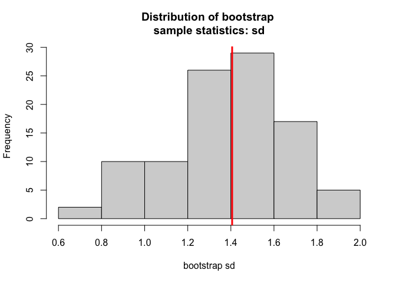
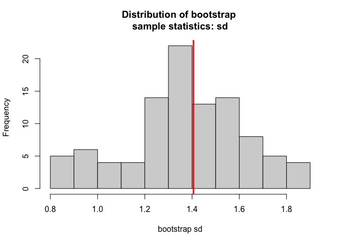
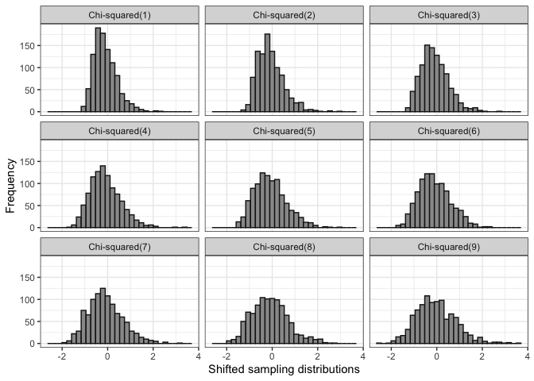
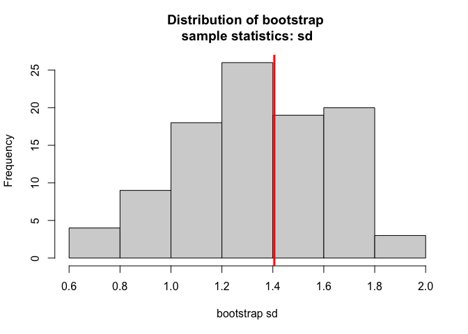
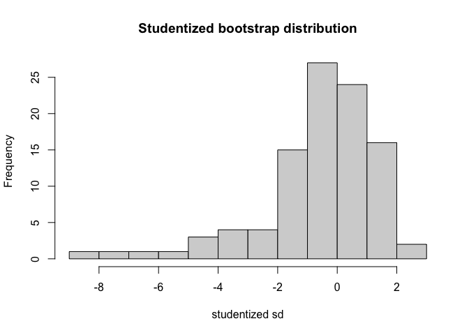
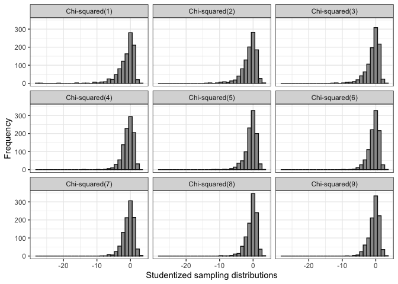

## Introduction

Use `devtools` to install `bootEd` if you have not already done so:

    devtools::install_github("tottyn/bootEd")

Load `bootEd` and the `tidyverse`, which we will use for plotting and
data manipulation:

    library(bootEd)
    library(tidyverse)

    ## ── Attaching packages ─────────────────────────────────────── tidyverse 1.3.1 ──

    ## ✓ ggplot2 3.3.5     ✓ purrr   0.3.4
    ## ✓ tibble  3.1.4     ✓ dplyr   1.0.7
    ## ✓ tidyr   1.1.3     ✓ stringr 1.4.0
    ## ✓ readr   2.0.0     ✓ forcats 0.5.1

    ## ── Conflicts ────────────────────────────────────────── tidyverse_conflicts() ──
    ## x dplyr::filter() masks stats::filter()
    ## x dplyr::lag()    masks stats::lag()

The `bootEd` package was created so that more emphasis could easily be
placed on the assumptions behind these intervals when teaching them.
There are just three functions in `bootEd`: `percentile`, `basic`, and
`studentized`. These can be used to construct the bootstrap intervals
that they are named after. The output of these functions gives the
assumptions as well as plots which can be used to assess their
plausibility.

## Basic and Percentile interval

To construct the basic bootstrap interval for the population standard
deviation, we use the following code:

    # generate a sample of size 20 from a Chi-squared(2) population
    set.seed(450)
    sample <- rchisq(20, 2)

    # obtain 90% basic bootstrap interval using 99 bootstrap samples
    set.seed(300)
    basic(sample, parameter = "sd", B = 99, siglevel = 0.10, onlyint = FALSE)

    ## The basic bootstrap interval for the sd is: (1.00033, 1.876807).
    ## 
    ## If it is reasonable to assume that the shifted sampling distribution of the 
    ## statistic of interest does not depend on any unknown parameters, 
    ## such as the underlying population variance, then this method can be used.

A 90% percentile bootstrap interval for the population standard
deviation can be constructed similarly:

    # get percentile interval
    set.seed(340)
    percentile(sample, parameter = "sd", B = 99, siglevel = 0.10, onlyint = FALSE)

    ## The percentile bootstrap interval for the sd is: (0.8911509, 1.784055).
    ## 
    ## If it is reasonable to assume that the shifted sampling distribution of the 
    ## statistic of interest is symmetric and does not depend on any unknown parameters, 
    ## such as the underlying population variance, then this method can be used.

To check the assumptions of these intervals, we use simulations to
generate shifted sampling distributions of the standard deviation from
different underlying populations. If these are approximately the same
and symmetric across all populations, then the assumptions of these
methods are reasonable.

    # degrees of freedom
    k <- 1:9

    # matrix to save results in - for each population, Chi-square(k), we will obtain 1000 sample standard deviations
    sampsds <- matrix(0, nrow = 1000, ncol = length(k))

    for(i in 1:length(k)){ # for each population (i.e. value of k)
      
      # generate 1000 samples of size 20 from a Chi-square(k) distribution
      sampmat <- matrix(rchisq(20*1000, k[i]), ncol = 1000)
      
      # calculate sample standard deviations and shift by population parameter (sample sd - population sd)
      sampsds[,i] <- apply(sampmat, 2, sd) - sqrt(2*k[i]) # var = 2k
      
    }

    # save as dataframe for use in ggplot
    sd_data <- as.data.frame(sampsds)

    # change column names to specify population
    colnames(sd_data) <- paste("Chi-squared(", k, ")", sep = "")

    # gather column names and values to create one factor variable giving population and one giving sample sd
    sd_data <- gather(sd_data, key = "population", value = "sd")

Finally we plot the distributions. Though there is rough symmetry, these
distributions are not approximately the same across different
populations. Therefore, the assumptions of the basic and percentile
bootstrap intervals are not met.

    # plot distributions
    ggplot(sd_data) +
      geom_histogram(aes(sd), fill = "gray60", color = "gray8") +
      facet_wrap(~population) + # facet by population
      theme_bw() +
      labs(x = "Shifted sampling distributions", y = "Frequency")

    ## `stat_bin()` using `bins = 30`. Pick better value with `binwidth`.

Notice that the intervals we obtained also *did not* contain the
population standard deviation, which is 2. In the long-run, there are
consequences to using these intervals inappropriately:

    # return to the Chi-squared(2) case and generate 1000 samples of size 20
    chisq2mat <- matrix(rchisq(20*1000, 2), ncol = 1000)

    # for each sample, calculate basic and percentile bootstrap intervals - return only the intervals - each row is an interval after transposing
    basic_ints <- t(apply(chisq2mat, 2, basic, parameter = "sd", B = 99, siglevel = 0.10, onlyint = TRUE))
    percentile_ints <- t(apply(chisq2mat, 2, percentile, parameter = "sd", B = 99, siglevel = 0.10, onlyint = TRUE))

    # what proportion of intervals contain the true parameter?
    mean(basic_ints[,1] <= 2 & basic_ints[,2] >= 2)

    ## [1] 0.691

    mean(percentile_ints[,1] <= 2 & percentile_ints[,2] >= 2)

    ## [1] 0.642

The proportion of intervals that contained the true parameter should be
1 − `siglevel` = 0.90 since these were 90% bootstrap intervals. However,
the coverage proportions we obtained were quite far from the nominal
0.90. This indicates that these intervals perform poorly when their
assumptions are not met and they are not likely to capture the true
parameter. If a larger sample size and/or number of bootstrap samples is
used, we may see improvmenets, but this is not guaranteed.

# Studentized interval

One source of varation in the sampling distributions generated earlier
was the spread of the values. Each distribution had a different amount
of spread and some were more or less skewed than others. The studentized
interval assumes that the studentized sampling distribution, which takes
into account the spread in each sample, is approximately the same across
different populations.

To construct a studentized interval with the same sample data, we can
use the following code:

    # obtain studentized bootstrap interval
    set.seed(985)
    studentized(sample, parameter = "sd", B = 99, siglevel = 0.10, onlyint = FALSE)

    ## The studentized bootstrap interval for the sd is: (0.9340625, 2.721656).
    ## 
    ## If it is reasonable to assume that the studentized sampling distribution of the 
    ## statistic of interest does not depend on any unknown parameters, 
    ## then this method can be used.

The original and studentized bootstrap distributions are returned. The
bootstrap statistics are studentized using a second-level estimate of
standard error.

To check if the assumption of this interval is reasonable, we generate
studentized sampling distributions, using samples from a variety of
populations:

    # for each population, Chi-square(k), we will obtain 1000 studentized sample standard deviations
    sampsds_studentized <- matrix(0, nrow = 1000, ncol = length(k))

    for(i in 1:length(k)){ # for each population
      
      # generate 1000 samples of size 20 from a Chi-square(k) distribution
      sampmat <- matrix(rchisq(20*1000, k[i]), ncol = 1000)
      
      # for each sample calculate sample sd - population sd
      sampsds_shift <- apply(sampmat, 2, sd) - sqrt(2*k[i])
      
      # calculate bootstrap estimates of standard error using 99 bootstrap samples from each sample
      bootse <- apply(sampmat, 2, function(x) sd(apply(matrix(sample(x, length(x)*99, replace = TRUE), ncol = 99), 2, sd)))
      
      # calculate and save studentized sample statistics
      sampsds_studentized[,i] <- sampsds_shift/bootse
      
    }

    # save as dataframe for use in ggplot
    sd_data_studentized <- as.data.frame(sampsds_studentized)

    # change column names to specify degrees of freedom
    colnames(sd_data_studentized) <- paste("Chi-squared(", k, ")", sep = "")

    # gather column names and value to create one factor variable giving population and one giving sample sd
    sd_data_studentized <- gather(sd_data_studentized, key = "population", value = "sd")

Though these distributions are more similar than when we only shifted by
the population standard deviation, there are still differences in their
skewness. Therefore, the assumptions of the studentized interval are not
met in this case either.

    # plot distributions
    ggplot(sd_data_studentized) +
      geom_histogram(aes(sd), fill = "gray60", color = "gray8") +
      facet_wrap(~population) +
      theme_bw() +
      labs(x = "Studentized sampling distributions", y = "Frequency")

    ## `stat_bin()` using `bins = 30`. Pick better value with `binwidth`.

If we apply this method in this scenario, the coverage proportion is a
bit closer to 0.90 but still far off. The second-level bootstrap
estimate of standard error can be unreliable when the sample size is
small.

    # for each sample, calculate studentized interval
    studentized_ints <- t(apply(chisq2mat, 2, studentized, parameter = "sd", B = 99, siglevel = 0.10, onlyint = TRUE))

    # what proportion of intervals contain the true parameter?
    mean(studentized_ints[,1] <= 2 & studentized_ints[,2] >= 2)

    ## [1] 0.815

As with the basic and percentile bootstrap intervals, these results
could improve if we increase the sample size, number of simulations, or
number of bootstrap samples used.

These and other simulations can be performed in the classroom with
students to help them understand that these methods have assumptions
which should also be checked.
